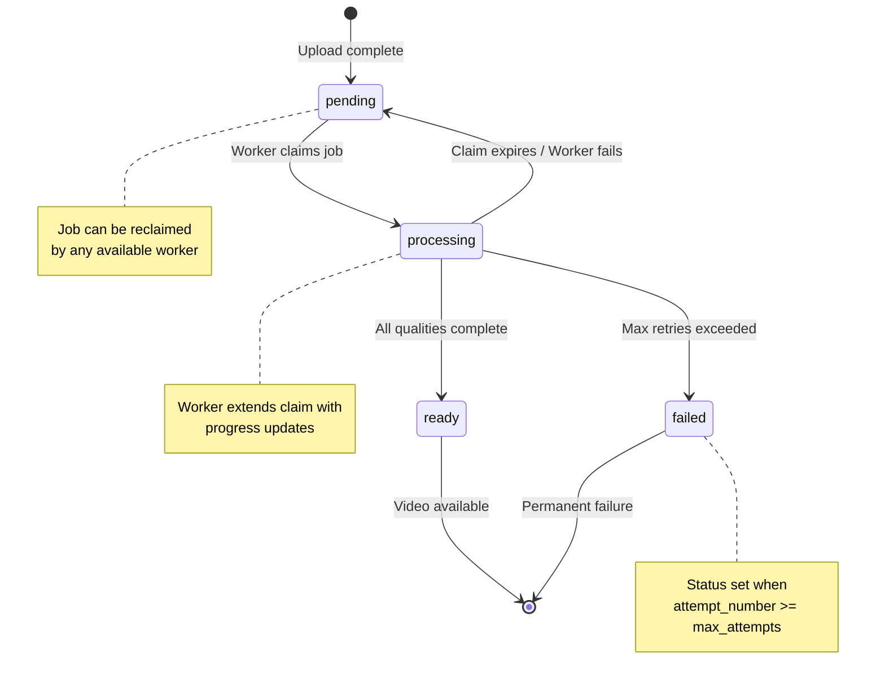
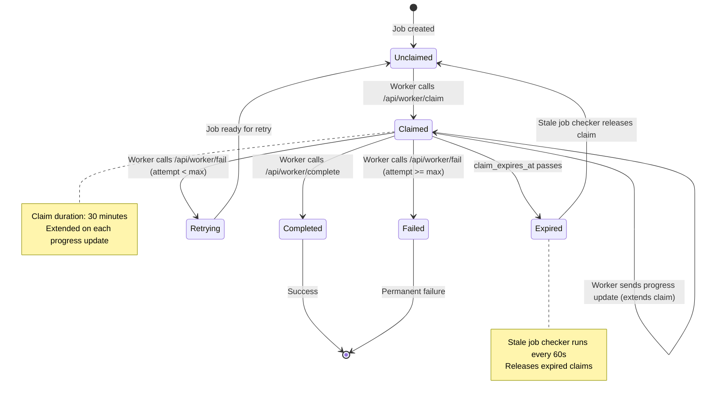
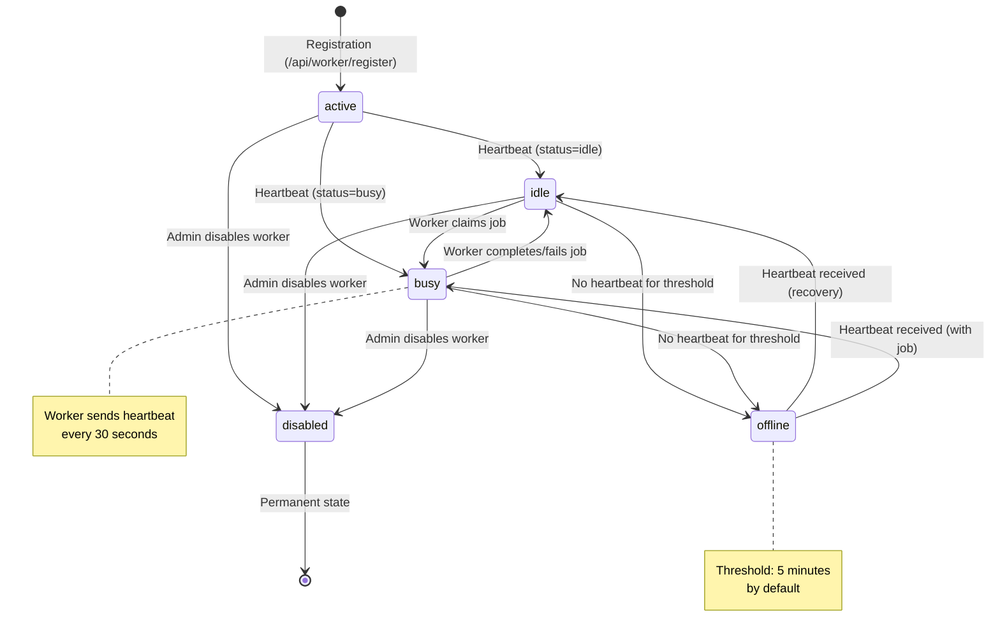

# Transcoding Job Lifecycle and State Machine

## Overview

VLog's transcoding system supports both local (event-driven) and distributed (containerized) workers. This document describes the complete job lifecycle, state transitions, and distributed coordination mechanisms that ensure reliable video processing.

## Architecture Components

### 1. Video Status (Primary State)

Videos have a status field that represents the overall processing state:

```python
class VideoStatus(str, Enum):
    PENDING = "pending"      # Uploaded, waiting for transcoding
    PROCESSING = "processing" # Being transcoded by a worker
    READY = "ready"          # Transcoding complete, ready to stream
    FAILED = "failed"        # Transcoding failed permanently (max retries exceeded)
```

### 2. Transcoding Job (Secondary State)

Each video has a corresponding `transcoding_jobs` record that tracks detailed progress:

**Job State Fields:**
- `claimed_at`: When a worker claimed this job (NULL = unclaimed)
- `claim_expires_at`: When the claim expires (NULL = no claim)
- `worker_id`: UUID of the worker processing this job (NULL = no worker)
- `completed_at`: When transcoding finished (NULL = not complete)
- `attempt_number`: Current retry attempt (1-based)
- `max_attempts`: Maximum allowed retries (default: 3)
- `last_error`: Error message from most recent failure (NULL = no error)

**Progress Tracking Fields:**
- `current_step`: Current processing phase (probe, thumbnail, transcode, master_playlist, finalize)
- `progress_percent`: Overall progress (0-100)
- `started_at`: When worker first started processing
- `last_checkpoint`: Last progress update timestamp

**Audit Fields:**
- `processed_by_worker_id`: Permanent record of which worker processed this job
- `processed_by_worker_name`: Human-readable worker name for debugging

**Derived Job States:**

| State | Conditions | Meaning |
|-------|-----------|---------|
| **Unclaimed** | `claimed_at = NULL AND completed_at = NULL` | Available for workers to claim |
| **Claimed** | `claimed_at != NULL AND claim_expires_at > NOW() AND completed_at = NULL` | Actively processing (claim valid) |
| **Expired** | `claimed_at != NULL AND claim_expires_at <= NOW() AND completed_at = NULL` | Worker failed to update, ready for reclaim |
| **Completed** | `completed_at != NULL` | Transcoding finished successfully |
| **Failed** | `last_error != NULL AND attempt_number >= max_attempts` | Permanently failed |
| **Retrying** | `last_error != NULL AND attempt_number < max_attempts AND claimed_at = NULL` | Failed but will retry |

### 3. Worker Status

Workers have a status field that indicates availability and health:

```python
# Worker status values (not an enum, stored as string)
"active"   # Recently heartbeated, available for work
"idle"     # Active but not currently processing (used for GPU priority)
"busy"     # Currently processing a job
"offline"  # No recent heartbeat (threshold: WORKER_OFFLINE_THRESHOLD_MINUTES)
"disabled" # Manually disabled by admin
```

**Worker State Fields:**
- `worker_id`: UUID for this worker (unique)
- `worker_name`: Human-readable name (optional)
- `worker_type`: "local" or "remote"
- `registered_at`: When worker was registered
- `last_heartbeat`: Last heartbeat timestamp (NULL = never heartbeated)
- `status`: Current worker status
- `current_job_id`: Job currently being processed (NULL = idle)
- `capabilities`: JSON metadata about worker capabilities (GPU, codecs, etc.)
- `metadata`: JSON metadata (Kubernetes pod info, etc.)

### 4. Quality Progress (Per-Quality Checkpoints)

Each job can have multiple quality variants (2160p, 1080p, 720p, etc.). Progress is tracked per-quality:

```python
class QualityStatus(str, Enum):
    PENDING = "pending"        # Not started yet
    IN_PROGRESS = "in_progress" # Currently encoding
    COMPLETED = "completed"     # Successfully encoded
    FAILED = "failed"          # Encoding failed
    SKIPPED = "skipped"        # Not applicable (quality > source resolution)
```

**Quality Progress Fields:**
- `quality`: Quality variant name (e.g., "1080p")
- `status`: Current encoding status
- `segments_total`: Total HLS segments to encode
- `segments_completed`: Number of segments finished
- `progress_percent`: Quality-specific progress (0-100)
- `started_at`: When quality encoding started
- `completed_at`: When quality encoding finished
- `error_message`: Error if encoding failed

## State Machine Diagrams

### Video Status State Machine



### Job Lifecycle State Machine



### Worker State Machine



## State Transitions

### 1. Job Creation

**Trigger:** Video uploaded via Admin API

**Process:**
1. Admin API saves file to `UPLOADS_DIR/{video_id}.ext`
2. Database transaction creates:
   - `videos` record with `status = 'pending'`
   - `transcoding_jobs` record with `claimed_at = NULL`
3. Optional: Job pushed to Redis Streams for instant dispatch
4. Local worker detects via inotify (event-driven)
5. Remote workers poll or receive Redis notification

**Atomicity:** Single database transaction ensures consistency

### 2. Job Claiming

**Trigger:** Worker calls `POST /api/worker/claim`

**Process (Atomic Transaction):**
1. Check GPU priority (CPU workers defer to idle GPU workers)
2. Lock unclaimed job with `FOR UPDATE SKIP LOCKED` (PostgreSQL)
3. Verify conditions:
   - `video.status = 'pending'` OR (`video.status = 'ready'` AND `job.retranscode_metadata IS NOT NULL`)
   - `video.deleted_at IS NULL`
   - `job.claimed_at IS NULL`
   - `job.completed_at IS NULL`
4. Update job:
   - `worker_id = <worker_uuid>`
   - `claimed_at = NOW()`
   - `claim_expires_at = NOW() + 30 minutes`
   - `started_at = NOW()` (if first claim)
   - `processed_by_worker_id/name` (permanent audit record)
5. Update video: `status = 'processing'`
6. Update worker: `current_job_id = <job_id>`, `status = 'busy'`

**Distributed Safety:**
- PostgreSQL: `FOR UPDATE SKIP LOCKED` prevents double-claiming
- SQLite: Database-level transaction locking (single-instance only)
- Claims expire automatically after 30 minutes if no progress updates

**GPU Priority Logic:**
- CPU workers check for idle GPU workers before claiming
- CPU worker defers if GPU worker heartbeated within 2× heartbeat interval
- Prevents GPU worker starvation while avoiding CPU worker deadlock
- Threshold: `WORKER_HEARTBEAT_INTERVAL * 2` (default: 60 seconds)

### 3. Progress Updates

**Trigger:** Worker calls `POST /api/worker/progress`

**Process:**
1. Verify worker owns the job (`job.worker_id = worker.worker_id`)
2. Check claim validity (`claim_expires_at > NOW()`)
3. Update job:
   - `current_step = <step>` (probe, thumbnail, transcode, etc.)
   - `progress_percent = <0-100>`
   - `last_checkpoint = NOW()`
   - `claim_expires_at = NOW() + 30 minutes` (**claim extension**)
4. Update per-quality progress in `quality_progress` table
5. Publish progress to Redis Pub/Sub for real-time UI updates

**Claim Extension:**
- Each progress update extends claim by 30 minutes
- Prevents timeout during long-running transcodes
- Workers should send updates at least every 15 minutes

### 4. Job Completion

**Trigger:** Worker calls `POST /api/worker/complete`

**Process (Atomic Transaction):**
1. Verify worker owns the job and claim is valid
2. Update job:
   - `completed_at = NOW()`
   - `progress_percent = 100`
   - `current_step = 'finalize'`
3. Update video:
   - `status = 'ready'`
   - `duration = <duration>`
   - `error_message = NULL` (clear any previous errors)
4. Create `video_qualities` records for each transcoded quality
5. Update worker:
   - `current_job_id = NULL`
   - `status = 'idle'`
6. Publish completion to Redis Pub/Sub

**File Finalization:**
- Worker uploads HLS output as tar.gz (remote workers)
- Worker API extracts to `VIDEOS_DIR/{slug}/`
- Validates master.m3u8 and quality playlists exist

### 4a. Retranscode with Deferred Cleanup (Issue #408)

When a video is queued for retranscoding, it remains playable until a worker claims the job.

**Retranscode Request:**
1. Admin calls `POST /api/videos/{id}/retranscode`
2. System creates transcoding job with `retranscode_metadata` JSON:
   ```json
   {
     "retranscode_all": true,
     "qualities_to_delete": ["1080p", "720p", "480p"],
     "delete_transcription": true,
     "video_dir": "/mnt/nas/vlog-storage/videos/my-video"
   }
   ```
3. Video status remains `ready` (still playable)
4. Job is marked as available for claiming

**Claim with Cleanup:**
1. Worker claims job (see section 2)
2. If `retranscode_metadata` is present:
   - Delete specified quality files from disk
   - Delete `video_qualities` records for those qualities
   - Delete transcription record if `delete_transcription` is true
   - Clear `retranscode_metadata` field
3. Update video status to `processing`
4. Proceed with normal transcoding

**Benefits:**
- Videos remain watchable while queued for retranscoding
- Cleanup happens atomically with job claim
- No orphaned files if job is never claimed (video stays ready)

### 5. Job Failure

**Trigger:** Worker calls `POST /api/worker/fail`

**Process (Atomic Transaction):**
1. Verify worker owns the job
2. Update job:
   - `last_error = <error_message>` (truncated to max length)
   - `attempt_number = attempt_number + 1`
3. Check retry eligibility:
   - If `attempt_number < max_attempts`:
     - Release claim: `claimed_at = NULL`, `claim_expires_at = NULL`, `worker_id = NULL`
     - Update video: `status = 'pending'` (ready for retry)
   - If `attempt_number >= max_attempts`:
     - Update video: `status = 'failed'`, `error_message = <error>`
     - Keep claim data for audit trail
4. Update worker: `current_job_id = NULL`, `status = 'idle'`
5. Optional: Send webhook alert for max retries exceeded

**Retry Behavior:**
- Default: 3 attempts per job
- Per-quality checkpoints preserved across retries
- Completed qualities not re-encoded (configurable)
- Alert sent for repeated failures (pattern detection)

### 6. Claim Expiration and Stale Detection

**Trigger:** Background task `check_stale_jobs()` (runs every 60 seconds)

**Process:**
1. Wait for startup grace period (2 minutes after API start)
2. Find workers with stale heartbeats:
   - `status != 'offline'`
   - `last_heartbeat < NOW() - 5 minutes` OR
   - `last_heartbeat IS NULL AND registered_at < NOW() - 5 minutes`
3. **Atomic conditional update** (per worker):
   - Mark offline only if heartbeat still stale
   - Prevents race with concurrent heartbeat
4. Find jobs claimed by offline worker with expired claims:
   - `job.worker_id = <offline_worker>`
   - `job.completed_at IS NULL`
   - `job.claim_expires_at < NOW() OR claim_expires_at IS NULL`
5. Release each stale job:
   - Clear claim: `claimed_at = NULL`, `claim_expires_at = NULL`, `worker_id = NULL`, `current_step = NULL`
   - Reset video: `status = 'pending'`
6. Optional: Send webhook alert for stale job recovery

**Race Condition Prevention:**
- **Worker offline check:** Conditional update with timestamp check prevents marking worker offline after valid heartbeat
- **Job release:** Only releases jobs with expired claims, not all jobs from offline workers
- **Grace period:** 2-minute hardcoded delay after API startup allows workers to reconnect (not configurable)

**Stale vs. Expired:**
- **Stale worker:** No heartbeat for 5+ minutes (offline threshold)
- **Expired claim:** `claim_expires_at` passed (no progress updates)
- A job is only released when **both** conditions are met

### 7. Worker Registration

**Trigger:** Admin calls `POST /api/worker/register` (requires admin secret)

**Process (Atomic Transaction):**
1. Verify `X-Admin-Secret` header matches `VLOG_WORKER_ADMIN_SECRET`
2. Generate:
   - `worker_id = <UUID>`
   - `api_key = <256-bit token>`
   - `key_hash = SHA256(api_key)`
   - `key_prefix = api_key[:8]` (for fast lookup)
3. Validate capabilities and metadata JSON (10KB max each)
4. Create `workers` record:
   - `status = 'active'`
   - `last_heartbeat = NOW()`
5. Create `worker_api_keys` record:
   - `key_hash`, `key_prefix`, `created_at`
6. Return `api_key` to admin (only shown once)

**Security:**
- API keys are hashed (SHA-256) before storage
- Only key prefix stored in plaintext for fast lookup
- Keys can be revoked by admin
- Worker API uses API key authentication (not cookies)

### 8. Worker Offline Detection

**Trigger:** Background task `check_stale_jobs()` (runs every 60 seconds)

**Conditions:**
- Worker has `status != 'offline'`
- Worker's `last_heartbeat < NOW() - WORKER_OFFLINE_THRESHOLD_MINUTES`
- OR worker never sent heartbeat (`last_heartbeat IS NULL`) and `registered_at < NOW() - WORKER_OFFLINE_THRESHOLD_MINUTES`

**Process:**
1. Atomic conditional update to `status = 'offline'`
2. Clear `current_job_id`
3. Release any jobs with expired claims (see section 6)

**Threshold:**
- Default: 5 minutes (`WORKER_OFFLINE_THRESHOLD_MINUTES`)
- Configurable via `VLOG_WORKER_OFFLINE_THRESHOLD_MINUTES`
- Grace period: 2 minutes after API startup

**Recovery:**
- Worker comes back online with next heartbeat
- Status transitions: `offline -> idle` or `offline -> busy`
- Recovery logged for debugging

## Edge Cases and Race Conditions

### 1. Double Claiming (Multiple Workers)

**Problem:** Two workers try to claim the same job simultaneously

**Solution:** PostgreSQL `FOR UPDATE SKIP LOCKED`
- First worker acquires row lock
- Second worker skips locked row and selects next job
- Transaction isolation prevents both claiming same job

**Limitation:** SQLite uses database-level locking (single-instance only)

### 2. Worker Crash During Transcoding

**Problem:** Worker crashes mid-job without calling fail endpoint

**Solution:** Automatic claim expiration
- Claim expires after 30 minutes without progress updates
- Stale job checker detects expired claim and releases job
- Job returns to `pending` state for another worker
- Per-quality checkpoints preserved for resume

### 3. Worker Offline But Job Not Released

**Problem:** Worker marked offline but job still claimed

**Solution:** Two-condition check
- Stale checker only releases jobs where:
  1. Worker is offline (no heartbeat)
  2. Claim has expired (`claim_expires_at < NOW()`)
- Prevents releasing jobs that might still complete

### 4. Heartbeat Arrives During Offline Check

**Problem:** Worker sends heartbeat while stale checker is marking it offline

**Solution:** Atomic conditional update
```sql
UPDATE workers SET status = 'offline'
WHERE id = ? 
  AND status != 'offline'
  AND last_heartbeat < ?  -- Timestamp checked at UPDATE time
```
- If heartbeat updated `last_heartbeat` between SELECT and UPDATE, UPDATE returns 0 rows
- Worker not marked offline, stale checker logs recovery

### 5. GPU Worker Priority Starvation

**Problem:** CPU workers claim all jobs before GPU workers can poll

**Solution:** GPU priority with timeout
- CPU workers check for idle GPU workers before claiming
- CPU worker defers if GPU worker heartbeated within 60 seconds (2× heartbeat interval)
- After 60 seconds, CPU worker can proceed (prevents deadlock)
- Configurable via `WORKER_HEARTBEAT_INTERVAL`

### 6. API Restart While Jobs Processing

**Problem:** API restarts, workers continue processing but appear stale

**Solution:** Startup grace period
- Stale checker waits 2 minutes after API start (hardcoded in worker_api.py)
- Allows workers to send heartbeats and reconnect
- Prevents false-positive stale detection
- Not configurable via environment variable

### 7. Worker Completes Job After Claim Expired

**Problem:** Worker finishes transcoding but claim expired, job reassigned

**Solution:** Claim validity check
- Complete/fail endpoints verify claim ownership
- If claim expired: return 409 Conflict
- Worker detects error and abandons job (doesn't upload files)
- New worker will start fresh

### 8. Non-Transactional Stale Claim Cleanup

**Problem:** Clearing claim and resetting video status in separate operations

**Solution:** Single transaction for claim release
- Both operations in same database transaction
- Either both succeed or both fail
- Prevents inconsistent state (claimed job with pending video)

### 9. NULL Heartbeat Detection

**Problem:** Worker registered but never sent heartbeat

**Solution:** Check both conditions
```sql
WHERE (last_heartbeat < ? OR 
       (last_heartbeat IS NULL AND registered_at < ?))
```
- Detects workers that registered but never became active
- Uses `registered_at` as fallback timestamp

### 10. Parallel Quality Encoding

**Problem:** Multiple qualities encoding simultaneously, one fails

**Solution:** Per-quality status tracking
- Each quality has independent status in `quality_progress` table
- Failed quality marked as `failed`, others continue
- Job fails if any critical quality fails
- Completed qualities preserved on retry (configurable)

## Redis Integration

### Job Queue (Redis Streams)

**Mode:** Configurable (`VLOG_JOB_QUEUE_MODE`)
- `database`: Polling only (default)
- `redis`: Redis Streams required
- `hybrid`: Redis preferred, fallback to polling

**Benefits:**
- Instant job dispatch (no polling delay)
- Priority levels (high, normal, low)
- Consumer groups for load balancing
- At-least-once delivery guarantees

**Fallback:**
- Circuit breaker pattern on Redis failures
- Automatic fallback to database polling
- Exponential backoff on consecutive errors

### Real-Time Updates (Pub/Sub + SSE)

**Channels:**
- `worker_status`: Worker online/offline/busy/idle
- `transcode_progress:{video_id}`: Per-video progress updates
- `transcode_complete:{video_id}`: Completion notifications

**Benefits:**
- Real-time admin UI updates (no polling)
- Server-Sent Events (SSE) to browser
- Automatic reconnection with exponential backoff

**Configuration:**
- Heartbeat interval: 30 seconds (configurable)
- Reconnect timeout: 3 seconds (configurable)

## Monitoring and Alerting

### Webhook Alerts

**Events:**
- `stale_job_recovered`: Job recovered from crashed worker
- `job_max_retries_exceeded`: Job failed after all retries
- `job_failed_pattern`: Same video failed multiple times
- `worker_startup`: Worker came online (optional)
- `worker_shutdown`: Worker going offline (optional)

**Configuration:**
- `VLOG_ALERT_WEBHOOK_URL`: Webhook endpoint (Slack, Discord, custom)
- `VLOG_ALERT_RATE_LIMIT_SECONDS`: Cooldown between same alert type (default: 300s)
- `VLOG_ALERT_WEBHOOK_TIMEOUT`: HTTP timeout (default: 10s)

**Metrics:**
- Stale jobs recovered count
- Max retries exceeded count
- Total failures count

### Health Checks

**Worker API:** `GET /health`
- Database connectivity
- Redis connectivity (if enabled)
- Active workers count
- Pending jobs count

**Admin API:** `GET /api/health`
- Storage capacity
- Database status
- Processing statistics

## Configuration Reference

### Job Claiming
- `VLOG_WORKER_CLAIM_DURATION_MINUTES`: Claim duration (default: 30)
- `VLOG_WORKER_HEARTBEAT_INTERVAL`: Heartbeat frequency in seconds (default: 30)

### Stale Detection
- `VLOG_WORKER_OFFLINE_THRESHOLD_MINUTES`: Offline threshold (default: 5)
- `VLOG_STALE_JOB_CHECK_INTERVAL`: Check frequency in seconds (default: 60)
- `VLOG_JOB_STALE_TIMEOUT`: Maximum job duration in seconds (default: 1800)

### Retry Logic
- `VLOG_MAX_RETRY_ATTEMPTS`: Maximum retry attempts (default: 3)
- `VLOG_KEEP_COMPLETED_QUALITIES`: Preserve completed qualities on retry (default: true)
- `VLOG_CLEANUP_PARTIAL_ON_FAILURE`: Delete partial HLS on failure (default: true)

### Redis
- `VLOG_REDIS_URL`: Redis connection URL (empty = disabled)
- `VLOG_JOB_QUEUE_MODE`: Job queue mode (database, redis, hybrid)
- `VLOG_REDIS_POOL_SIZE`: Connection pool size (default: 10)

### Alerting
- `VLOG_ALERT_WEBHOOK_URL`: Webhook URL (empty = disabled)
- `VLOG_ALERT_RATE_LIMIT_SECONDS`: Alert cooldown (default: 300)
- `VLOG_ALERT_WEBHOOK_TIMEOUT`: HTTP timeout (default: 10)

## Testing Recommendations

### State Transition Tests
1. **Job Claiming:** Test atomic claiming with concurrent workers
2. **Claim Expiration:** Test expired claim detection and release
3. **Worker Offline:** Test heartbeat timeout and recovery
4. **Job Retry:** Test retry logic with various failure scenarios
5. **GPU Priority:** Test CPU/GPU worker prioritization

### Race Condition Tests
1. **Double Claim:** Multiple workers claiming same job
2. **Heartbeat Race:** Heartbeat during offline check
3. **Completion Race:** Complete after claim expired
4. **Stale Release Race:** Job released while worker completing

### Failure Recovery Tests
1. **Worker Crash:** Simulate crash during transcoding
2. **API Restart:** Test grace period and reconnection
3. **Database Lock:** Test transaction retry logic
4. **Redis Failure:** Test fallback to database polling

### Integration Tests
1. **End-to-End:** Upload → Transcode → Ready
2. **Multi-Worker:** Multiple workers processing concurrently
3. **Checkpoint Resume:** Crash and resume with checkpoints
4. **Quality Variants:** Test all quality ladder combinations

## Related Issues

- **#262**: Local/remote worker race condition (fixed with FOR UPDATE SKIP LOCKED)
- **#264**: GPU worker priority starvation (fixed with idle worker check)
- **#267**: Non-transactional stale claim cleanup (fixed with single transaction)
- **#273**: NULL heartbeat detection (fixed with registered_at fallback)
- **#408**: Keep videos playable until re-transcode begins (fixed with deferred cleanup)

## See Also

- [ARCHITECTURE.md](./ARCHITECTURE.md): Overall system architecture
- [DATABASE.md](./DATABASE.md): Database schema details
- [CONFIGURATION.md](./CONFIGURATION.md): Configuration options
- [API.md](./API.md): API endpoint documentation
